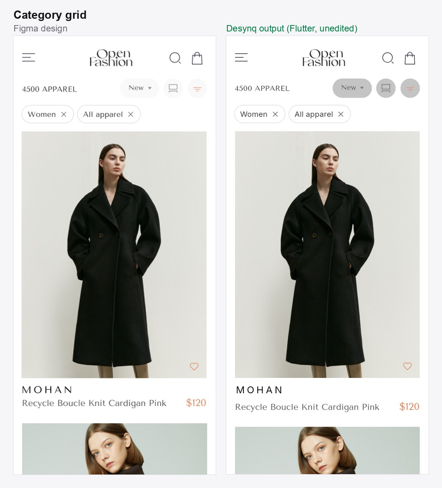
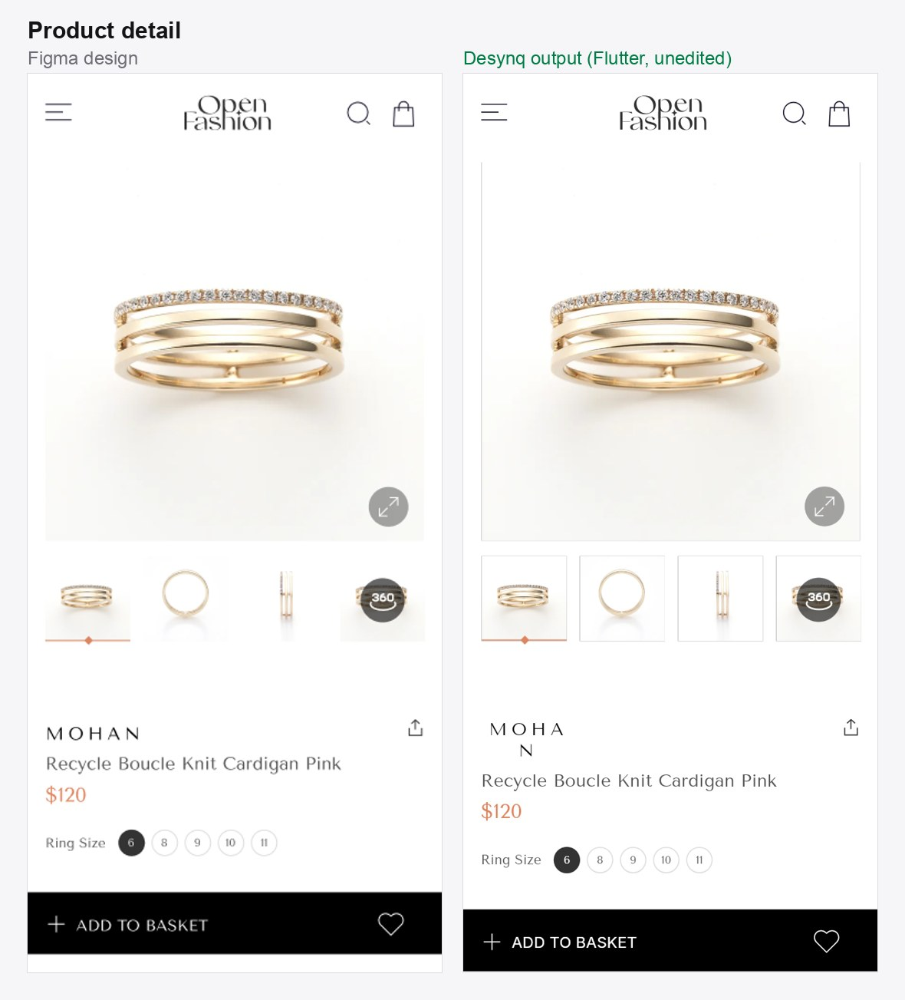

# Desynq examples — Figma to Flutter, real output

Real Flutter projects generated by **[Desynq](https://trydesynq.web.app)**, a free Figma to Flutter
converter. Each example shows the original Figma design next to what Desynq produced, and includes
the full project so you can run it yourself.

The screen code is **unedited engine output** — nobody tidied it up by hand, so what you see here is
what you get from the plugin. The only change: screens left out of an example were removed from its
menu, along with the images only they used.

## Open Fashion

A fashion e-commerce kit — a product grid and a product detail page.





**Run it:**

```bash
git clone https://github.com/Desynq-app/desynq-examples.git
cd desynq-examples/open-fashion
flutter create .   # adds android/ios/web for your Flutter version; keeps lib/ and assets/
flutter run
```

`lib/main.dart` opens a menu with both screens.

**Known issues in this output** (we list them rather than hide them):

- On the product page, the brand name "MOHAN" wraps onto two lines where Figma keeps it on one.
- The filter buttons on the category grid come out a shade darker grey than in the design.
- The kit's home page is left out of this example: its hero headline uses the wrong font and its
  logo is clipped. Both are open engine bugs.

## What to look for in the code

- **Real layout.** Screens are built from `Column`, `Row` and `ListView`, not a canvas of absolutely
  positioned widgets, so they reflow on different phone sizes.
- **Shared tokens.** Colours are pulled into `lib/colors.dart` and every image into one asset catalog,
  `lib/assets.dart`, instead of being repeated as literals.
- **Deterministic.** Desynq is not an AI code generator. The same Figma frame always produces the same
  Dart, so a design change shows up as a readable diff.

## Try it on your own design

1. Install the [Desynq Figma plugin](https://trydesynq.web.app/get-plugin).
2. Select a frame and export it.
3. Read the generated code, preview it live, and download the project.

Free to start, no card needed. Something came out wrong?
[Open an issue](https://github.com/Desynq-app/desynq-examples/issues) with a screenshot — fidelity
fixes ship regularly.

## Credits and licences

- **Designs:** [Open Fashion — Free eCommerce UI Kit](https://www.figma.com/community/file/1055151140671808467/open-fashion-free-ecommerce-ui-kit)
  by **UI Store Design** ([uistore.design](https://www.uistore.design/)), licensed under
  [CC BY 4.0](https://creativecommons.org/licenses/by/4.0/). The images in `open-fashion/assets/`
  and the Figma screenshots in `images/` come from that kit. Changes: the screens were converted to
  Flutter code by Desynq, and the images were re-exported at 1×/2×/3×.
- **Code:** the Flutter code in this repository is released under the [MIT License](LICENSE).

Desynq is not affiliated with UI Store Design.
